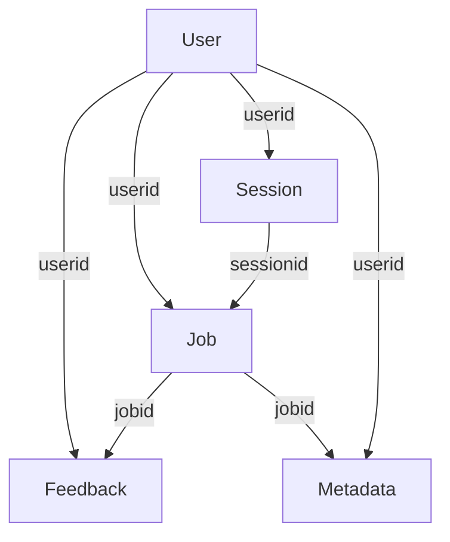

# chat-ui

A really simple FastAPI-based thing that provides a chatbot-looking UI.

## Configuration

All config options are prefixed with `CHATUI_`.

See the chatui.config.Config class for options, you can also set config options in `~/.config/chat-ui.json`.

## Request/Job flow

1. user sends a "job"
2. server takes the job and works on it in the background
3. user polls periodically for the response
4. winning

## Data outputs

The quoted terms/phrases should be in the "message" field of the log emitted when the action happens:

- when a job is submitted - "new job"
- when a job starts being processed - "starting job"
- when a job is completed, multiple:
  - "job completed" - completion data (`Jobs`)
  - "job metadata" - metadata - includes token use

There's also the `status` field in jobs which is logged, showing where they are in the processing pipeline.

